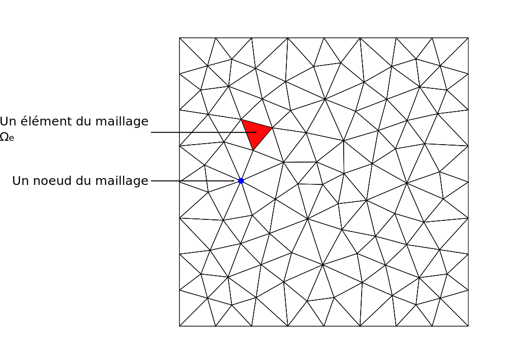
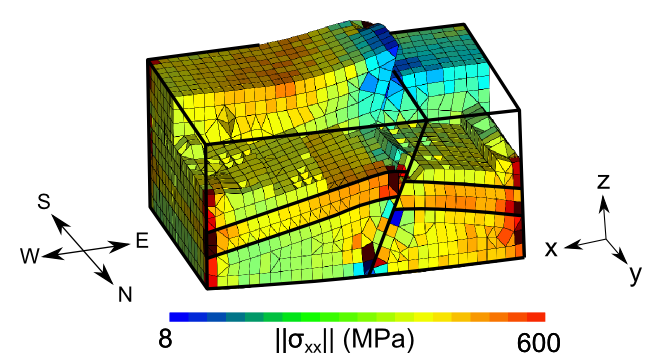
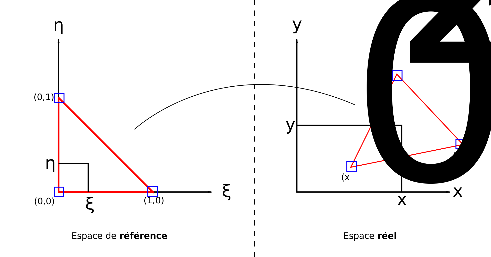
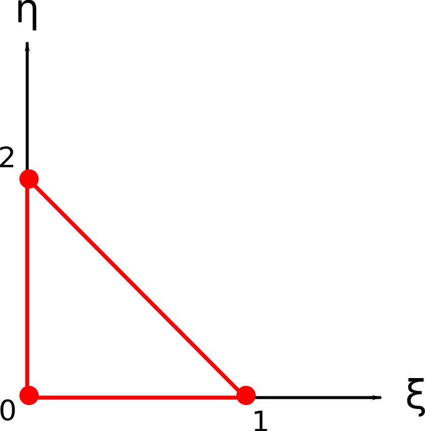
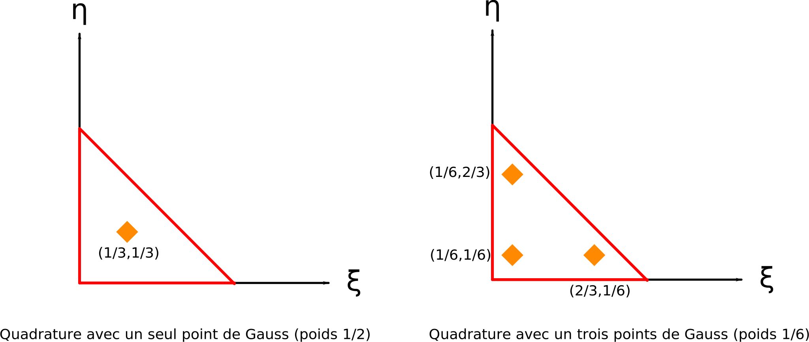
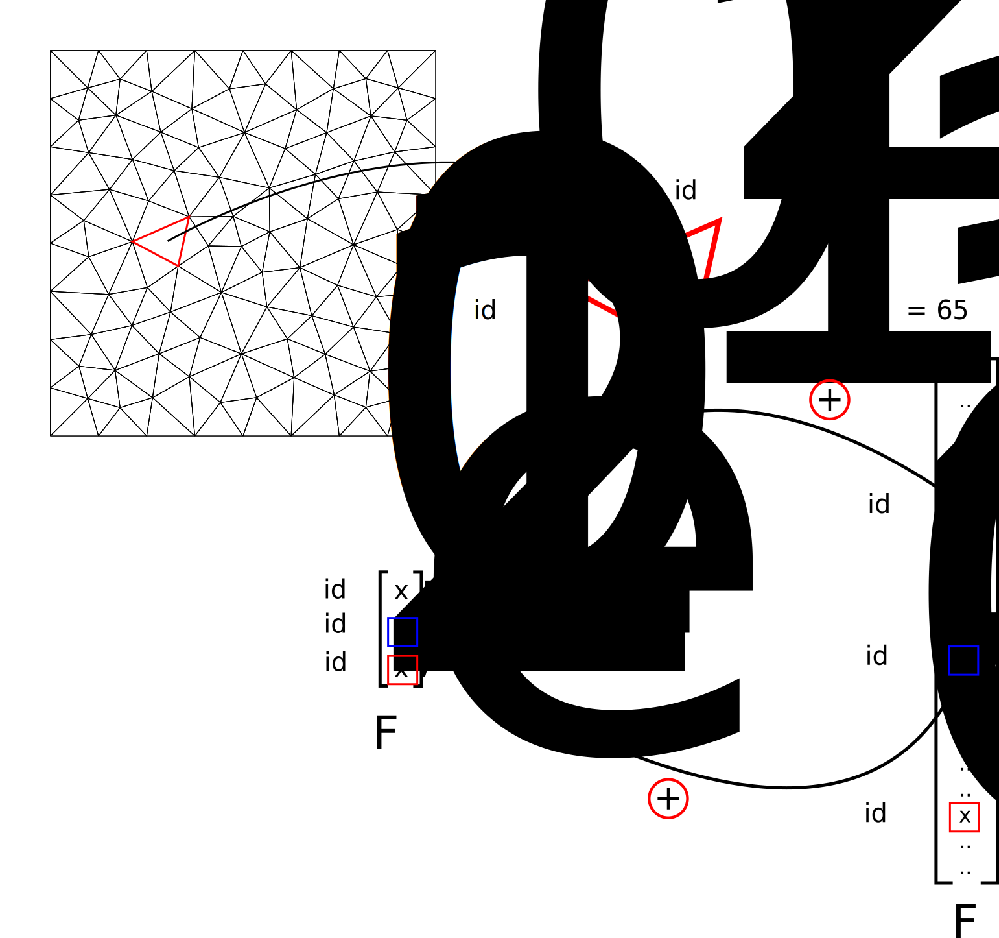
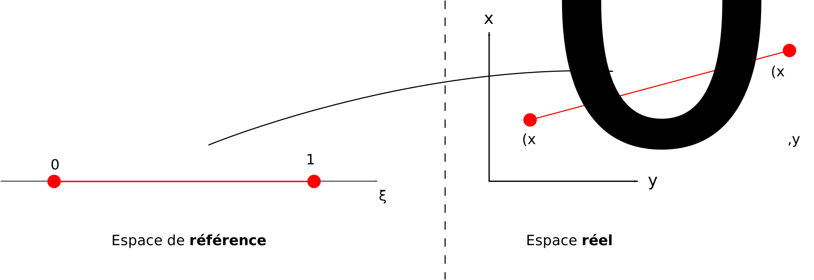

# Méthode des Éléments Finis

### Contexte : résoudre des EDP

La méthode des éléments finis est une méthode numérique pour résoudre des
équations aux dérivées partielles. Les équations aux dérivées partielles (EDP)
interviennent 

* en mécanique des solides (ex: calcul de déplacements et de contraintes élastiques),
* en thermique (ex: diffusion de la chaleur),
* en mécanique des fluides (ex: écoulement d'un fluide),
* plus généralement dans tous les domaines de la physique.

Ces équations ne peuvent généralement pas être résolues analytiquement,
c'est-à-dire qu'il n'est pas possible de trouver une expression mathématique de
la solution. Le but de la méthode des éléments finis est d'approximer cette
solution en discrétisant le milieu étudié (que nous appellerons $\Omega$).
La discrétisation du milieu forme un maillage, souvent composé de triangles ou
de quadrilatères en 2D et de tétraèdres ou d'hexaèdres en 3D. Les noeuds du
maillage (\+ éventuellement d'autres points comme le centre des arêtes ou des
faces) permettent de définir un ensemble fini de fonctions simples dans lequel on va
chercher la solution approchée de l'EDP.

**Attention :** Selon les codes et les livres, les notions de "noeud", "point" et "sommet"
peuvent varier. En anglais, on trouve les mots "node", "point" et "vertex".

#### Exemple d'application en Géomécanique :

Utilité :

* Calcul des contraintes dans les réservoirs pour le forage ou prévenir certains
risques
* Calcul des contraintes dans les mines ou tunnels pour dimensionner les
soutènements

#### Exemple d'application en Géophysique :

Utilité :

* Evaluation du risque sismique
* Caractérisation de la source sismique
* Tomographie sismique

### Résolution de l'équation de Poisson

Rappelons le problème à résoudre :

$$     
\left\{\begin{split}                                                                                                 
     -\Delta u &= f \text{ dans } \Omega\\                                                                           
     u &= g \text{ sur } \partial \Omega_D\\
     \nabla u \cdot n &=h \text{ sur } \partial \Omega_N
 \end{split}\right.
$$ 

avec $n$ la normale extérieure au bord du domaine $\Omega$, $u$ la
fonction inconnue que nous souhaitons approximer, $f$ la fonction source
(correspondant à une production de chaleur par exemple), $g$ les valeurs de
$u$ imposées sur le bord $\partial \Omega_D$ du domaine (conditions de
Dirichlet) et $h$ les valeurs du gradient de $u$ imposées sur le bord
$\partial \Omega_N$ du domaine (conditions de Neumann).

#### Formulation faible (ou variationnelle) :

Partons de l'équation de Poisson :

$$
-\Delta u(x,y) = f(x,y) .
$$

Introduisons une fonction-test $v$ définie sur $\Omega$ et vérifiant
$v=0$ sur $\Omega_D$ (conditions de Dirichlet dite *homogène*) et 
multiplions l'équation par cette fonction :

$$
-v(x,y)\Delta u(x,y) = v(x,y)f(x,y) .
$$

Intégrons ensuite sur tout le domaine $\Omega$ :

$$
-\int_{\Omega}v(x,y)\Delta u(x,y) = \int_{\Omega}v(x,y)f(x,y) .
$$

Le théorème de la divergence permet d'obtenir la formule d'intégration par partie suivante :

$$
\int_{\Omega}\nabla u(x,y) \nabla v(x,y)dxdy = \int_{\partial \Omega} v(x,y) \nabla u(x,y) n dS - \int_{\Omega} v(x,y) \Delta u(x,y)dxdy .
$$

Il vient alors

$$
\int_{\Omega}\nabla u(x,y) \nabla v(x,y)dxdy - \int_{\partial \Omega} v(x,y) \nabla u(x,y) n dS  = \int_{\Omega}v(x,y)f(x,y)dxdy .
$$

On peut décomposer l'intégrale sur $\partial\Omega$ :

$$
\int_{\partial \Omega} v(x,y) \nabla u(x,y) n dS = \int_{\partial \Omega_D} v(x,y) \nabla u(x,y) n dS + \int_{\partial \Omega_N} v(x,y) \nabla u(x,y) n dS .
$$

Comme $v = 0$ sur $\partial\Omega_D$, on obtient

$$
\int_{\Omega}\nabla u(x,y) \nabla v(x,y)dxdy - \int_{\partial \Omega_N} v(x,y) \nabla u(x,y) n dS  = \int_{\Omega}v(x,y)f(x,y)dxdy .
$$

Les conditions de Neumann $\nabla u \cdot n = h$ s'appliquant sur $\partial \Omega_N$, on a au final

$$
\int_{\Omega}\nabla u(x,y) \nabla v(x,y)dxdy - \int_{\partial \Omega_N} v(x,y) h(x,y) dS  = \int_{\Omega}v(x,y)f(x,y)dxdy .
$$

#### Discrétisation (et formation d'un système linéaire):

Jusqu'à maintenant, on a uniquement supposé que les fonctions $u$ et $v$
étaient définies dans l'espace des fonctions continues (pour pouvoir appliquer
l'intégration par partie plus haut). Or cet espace est de dimension infinie, ce
qui n'est pas pratique pour les ordinateurs. On se restreint alors à un
sous-espace de dimension finie décrit par une base de $n$ fonctions. En notant
$\phi_i$ ces fonctions de base, on peut écrire la décomposition suivante :

$$
u(x,y) = \sum_{i=0}^{n-1} u_i \phi_i(x,y)
$$

où les coefficients $u_i$ sont les inconnues de notre problème.

Par linéarité, on obtient

$$
\sum_{i=0}^{n-1} u_i \int_{\Omega}\nabla \phi_i \nabla v = \int_{\partial \Omega_N} v h  + \int_{\Omega}v f
$$

Cette équation est vraie pour toute fonction-test $v$, donc en prenant $v =
\phi_j \ \ \forall j \in [0,n-1]$ on obtient un système de $n$ équations à
$n$ inconnues :

$$
\sum_{i=0}^{n-1} u_i \int_{\Omega}\nabla \phi_i \nabla \phi_j = \int_{\partial \Omega_N} \phi_j h  + \int_{\Omega}\phi_j f \ \ \ \forall j \in [0,n-1]
$$

Ce système peut s'écrire sous forme matricielle :

$$
KU=F
$$

Les coefficients de la matrice $K$ et du vecteur $F$ se calculent en
décomposant les intégrales sur chaque élément du maillage et en additionnant
les contributions de chaque élément. La contribution de l'élément $e$ à la
matrice $K$ est (en introduisant le coefficient de diffusion $k$ que l'on avait omis jusqu'ici)

$$
K_e(i,j) = \int_{\Omega_e} k(x,y) \ \nabla\phi_i(x,y)\cdot\nabla\phi_j(x,y) \ dxdy
$$

La contribution de l'élément $e$ au vecteur $F$ est

$$
F_e(i) = \int_{\partial\Omega_{Ne}} \phi_i(x,y)h(x,y) \ dS + \int_{\Omega_e} \phi_i(x,y)f(x,y) \ dxdy
$$

#### L'élément de référence

Pour éviter d'introduire des fonctions de base et des lois d'intégration spécifiques à chaque élément, nous allons considérer un élément de référence sur lequel un unique ensemble de fonctions et de lois d'intégration sera défini, puis "mappé" vers chaque élément du domaine réel via une transformation géométrique. Cette transformation (ou *mapping*), notée $M_e$, donne les coordonnées $X=(x,y)$ dans l'élément réel $e$ d'un point quelconque $(\xi,\eta)$ de l'élément de référence :

$$
X = M_e(\xi,\eta) =  \sum_{i=0}^{N-1} \hat{\phi}_i(\xi,\eta)X_i
$$

où $N$ est le nombre de noeuds par élément, $X_i$ les coordonnées du noeud $i$ dans l'élément réel, et les $\hat{\phi}_i$ des fonctions d'interpolation définies dans l'espace de référence et appelées *fonctions de forme*.

Dans le triangle de référence, on définit les fonctions de forme comme suit:

$$
\begin{split}
\hat{\phi}_0(\xi,\eta) &= 1 - \xi - \eta \\
\hat{\phi}_1(\xi,\eta) &= \xi  \\
\hat{\phi}_2(\xi,\eta) &= \eta 
\end{split}
$$

Comme souvent lorsque l'on applique la méthode des éléments finis, nous prendrons ces fonctions de forme comme fonctions de base pour discrétiser l'espace fonctionnel dans lequel nous allons déterminer la solution approchée de notre problème (cf plus haut le paragraphe *Discrétisation*). Ainsi, on aura $n=N$ (mais ce n'est pas toujours pas le cas).

Le gradient des fonctions de base $\phi_i$ dans l'espace réel intervient dans l'expression de $K_e$. On calcul ce gradient à partir du gradient des fonctions $\hat{\phi}_i$ définies dans l'espace de référence et de la matrice jacobienne $J_e$ de la transformation $M_e$ :

$$
\nabla(\phi_i(x,y)) = (J_e^{-1})^T\nabla\hat{\phi}_i(\xi,\eta)
$$
$$
\text{où} \ \ \
J_e =\begin{bmatrix} 
\frac{\partial{x}}{\partial{\xi}} & \frac{\partial{x}}{\partial{\eta}} \\
\frac{\partial{y}}{\partial{\xi}} & \frac{\partial{y}}{\partial{\eta}} \\
\end{bmatrix}
$$

On peut alors reécrire l'expression de $K_e$ :

$$
K_e(i,j) = \int k(M_e(\xi,\eta)) \ (J_e^{-1})^T\nabla\hat{\phi}_i(\xi,\eta) \cdot (J_e^{-1})^T\nabla\hat{\phi}_j(\xi,\eta) \ |J_e(\xi,\eta)| \ d\xi d\eta
$$

#### Intégration

Pour intégrer une fonction $f$ sur un élément, on peut évaluer cette fonction
sur quelques points bien précis appelés points de Gauss (ou points
d'intégration) et pondérer les valeurs de la fonction en ces points par des
poids $w_q$ :

$$
\int_{\Omega_e} f(x,y)dxdy = \sum_{q=0}^{p-1}f(x_q)w_q
$$

où $p$ est le nombre de points de Gauss. Pour l'intégration de polynômes (ce
qui va être notre cas), on peut montrer que $p$ points de Gauss sont
nécessaires pour intégrer exactement des polynômes de degrés $2p-1$.

**Intégration dans le triangle de référence :** La position et le poids de chaque point de Gauss dans le triangle de référence sont donnés ci-dessous.

On peut alors réécrire l'expression de $K_e$ sous forme de somme :

$$
K_e(i,j) = \sum_{q=0}^{p-1} w_q \  k(M_e(\xi_q,\eta_q)) \ (J_e^{-1})^T\nabla\hat{\phi}_i(\xi_q,\eta_q) \cdot (J_e^{-1})^T\nabla\hat{\phi}_j(\xi_q,\eta_q) \ |J_e(\xi_q,\eta_q)|
$$

#### L'assemblage

Une fois la matrice $K_e$ de l'élément $e$ calculée par l'équation ci-dessus,
il faut en transférer les valeurs dans la matrice globale $K$. C'est ce qu'on
appelle *l'assemblage*. Le schéma suivant présente un cas concret où l'on cherche
à assembler la matrice élémentaire du triangle composé des noeuds 4, 36, et 65.

### Calcul et Assemblage de $F_e$

Le vecteur $F$ est le résultat de l'assemblage des vecteurs $F_e$. Ceux-ci
contiennent un terme source (qui fait intervenir $f$) et les conditions de
Neumann (qui font intervenir $h$).

#### Terme source 

Il s'ècrit

$$
F_e(i) = \int_{\Omega_e} \phi_i(x,y) f(x,y) \ dxdy
$$

En se plaçant dans l'élément de référence, on obtient

$$
F_e(i) = \int \hat{\phi}_i(\xi,\eta) f(M_e(\xi,\eta)) \ |J_e(\xi,\eta)| d\xi d\eta
$$

Puis, en utilisant la quadrature de Gauss, il vient

$$
F_e(i) =  \sum_{q=0}^{p-1} w_q \hat{\phi}_i(\xi_q,\eta_q) f(M_e(\xi_q,\eta_q)) \ |J_e(\xi_q,\eta_q)|
$$

L'assemblage des contributions de chaque élément $F_e$ dans le vecteur global
$F$ est réalisé de la même façon que précédemment :

#### Conditions de Neumann

Dans le cas de l'équation de diffusion de la chaleur, les conditions de Neumann correspondent à un flux de chaleur imposé sur les frontières du domaine. Son
expression est

$$
F_e(i) = \int_{\partial\Omega_{Ne}} \phi_i(x,y) h(x,y) \ dS
$$

En 2D, ces conditions s'appliquent sur des segments. Il nous faut donc définir
un segment de référence accompagné de fonctions de forme et d'une loi
d'intégration.

**Mapping des segments :** Le segment de référence est un élément 1D que l'on
va mapper vers un espace 2D.

Dans l'espace de référence, les fonctions de forme sont définies par

$$
\begin{split}
\hat{\phi}_0(\xi) &= 1 - \xi  \\
\hat{\phi}_1(\xi) &= \xi 
\end{split}
$$

Etant donné que l'espace de référence n'a pas la même dimension que l'espace réel,
la matrice jacobienne se réduit à un vecteur :

$$
J =\begin{bmatrix} 
\frac{\partial{x}}{\partial{\xi}} \\
\frac{\partial{y}}{\partial{\xi}} \\
\end{bmatrix}
$$

Le déterminant n'étant défini que pour des matrices carrés, nous utiliserons
$\sqrt{J^TJ}$ pour exprimer la condition de Neumann dans le triangle de
référence :

$$
F_e(i) = \int \hat{\phi}_i(\xi) \ h(M(\xi)) \ \sqrt{J^TJ(\xi)} \ d\xi
$$

En appliquant l'intégrale de Gauss, il vient

$$
F_e(i) = \sum_{q=0}^{p-1} w_q \hat{\phi}_i(\xi_q) \ h(M(\xi_q)) \ \sqrt{J^TJ(\xi_q)|}
$$

Il ne reste plus ensuite qu'à transférer la valeur obtenue dans le vecteur
global $F$.

### Application des conditions de Dirichlet

Appliquer une condition de Dirichlet consiste à imposer une valeur
de $u$ sur le bord $\partial\Omega_D$ du domaine. Dans le cas
de l'équation de diffusion de la chaleur, une telle condition revient
à imposer une température. Pour l'appliquer en pratique, on utilise
la **méthode de pénalité**.

Soit $j$ l'indice d'un point sur lequel on souhaite imposer $u = g$.
A la ligne $j$ du système à résoudre, on effectue cette opération :

$$
[ \ \ldots \ K(j,j)+P \ \ldots \ ] \ U(j) = F(j)+P \times g
$$

où $P$ est un gros coefficient qu'on prendra 1000 fois plus
grand que le plus grand terme de $K$.
Le terme de pénalité va donc "écraser" les autres termes
de la ligne, ce qui lors du passage dans le solver, reviendra à
résoudre :

$$
\begin{split}
(K(j,j) + P) \times U(j) &= F(j) + P \times g \\
 P \times U(j) &= P \times g \\
 U(j) &=  g \\
\end{split}
$$

### Résolution du système $KU=F$

Une fois l'assemblage de tous les éléments effectué, il ne reste plus qu'à
résoudre le système $KU=F$. Pour cela, on utilise des méthodes numériques
optimisées et déjà implémentées, comme le [gradient conjugué](https://fr.wikipedia.org/wiki/M%C3%A9thode_du_gradient_conjugu%C3%A9).
