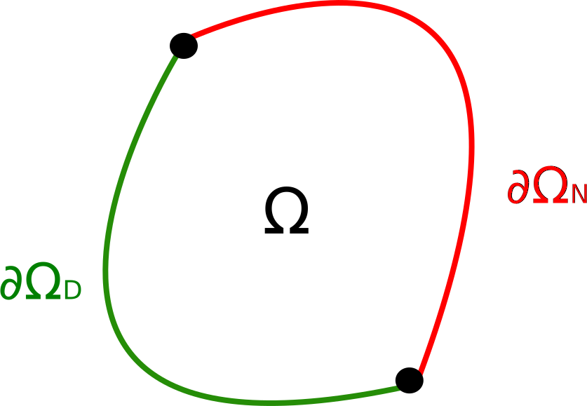

# Problème de Poisson 

### Équation de Poisson 

L'équation de Poisson permet de décrire des phénomènes de diffusion. Dans un
milieu homogène 2D, elle s'écrit
$$-k \Delta u(x,y) = f(x,y) .$$

Si le terme source $f$ est nul, il s'agit de l'équation de Laplace :
$$\Delta u = 0 .$$

Si le milieu est hétérogène avec un coefficient de diffusion $k$ variable dans
l'espace, on a alors 
$$- \text{div} [ k(x,y) \bar{\nabla} u(x,y) ] = f(x,y) .$$

**Interprétation** des termes mathématiques :

* Le gradient d'un champ scalaire
$$\bar{\nabla} u  = \left\( \frac{\partial u}{\partial x} , \frac{\partial u}{\partial y} \right\)^T.$$
décrit la variation locale du champ. Une valeur élevée de la composante $i$
du gradient indique que le champ varie beaucoup dans la direction $i$,
tandis qu'une valeur nulle correspond à un champ localement constant.

* La divergence d'un champ vectoriel 
$$\text{div} (v) = \frac{\partial v_x}{\partial x} + \frac{\partial v_y}{\partial y}$$
est un scalaire qui indique le bilan local (i.e. dans un volume infinitésimal) de ce qui rentre et de ce qui sort. Autrement dit, la divergence d'un vecteur traduit le changement de densité de la quantité portée par le vecteur. Ainsi, un champ à divergence nulle ne présente ni accumulation ni dispersion. C'est le cas de la vitesse d'un fluide incompressible par exemple.

* Le laplacien d'un champ scalaire
$$\Delta u = \text{div}(\bar{\nabla} u) = \frac{\partial^2 u}{\partial x^2} + \frac{\partial^2 u}{\partial y^2}$$ mesure la régularité du champ. Un laplacien élevé en un point $(x,y)$ indique que le champ $u$ y est très différent de la valeur moyenne de $u$ au voisinage de $(x,y)$. Au contraire, un laplacien nul veut dire que la fonction $u$ est "lisse": chaque valeur est la moyenne de son voisinage. C'est le cas de la diffusion de la chaleur dans un matériau qui ne produit/absorbe pas
de chaleur.

**Exemples** de phénomènes physiques décrit par l'équation de Poisson :

* Diffusion de la chaleur dans un matériau :
$$- \text{div} [ k(x,y) \bar{\nabla} T(x,y) ] = f(x,y)$$
avec $T$ la température, $f$ un terme de production ou d'absorption de chaleur et $k$ le coefficient de diffusion thermique.

* Gravitation newtonienne :
$$\Delta \phi = 4 \pi G \rho$$
avec $\phi$ le potentiel gravitationnel
(lié au champ gravitationnel par $\bar{g} = - \bar{\nabla} \phi$) et $\rho$ la masse volumique.

* Électrostatique :
$$\Delta V = - \frac{\rho}{\epsilon}$$
avec $V$ le potentiel électrostatique (lié au champ électrique par $\bar{E} = - \bar{\nabla} V$), $\rho$ la densité de charge et $\epsilon$ la permittivité électrique.

### Problème aux limites 

Un problème aux limites (*boundary value problem*) est défini par son équation aux dérivées partielles (équation de Poisson dans notre cas) et par des conditions aux limites qui imposent des la valeur du champ ou de son gradient sur le bord du domaine.

Les conditions aux limites classiques sont les conditions de Dirichlet (qui imposent la valeur du champ) et les conditions de Neumann (qui imposent la composante du gradient qui est normale au bord) :

Dirichlet : $$u(x,y) = g(x,y) \quad  \forall (x,y) \in \partial \Omega_D$$ 

Neumann : $$k(x,y) \bar{\nabla} u(x,y) \cdot \bar{n}(x,y)= h(x,y) \quad  \forall (x,y) \in \partial \Omega_N$$ 

Pour un problème de diffusion de la chaleur, les conditions de Dirichlet consistent à imposer la valeur de la température sur un bord (via un thermostat par exemple) et les conditions de Neumann consistent à imposer un flux de chaleur sur le bord.

### Autres équations aux dérivées partielles 

Exemples sur [Wikipedia](https://fr.wikipedia.org/wiki/%C3%89quation_aux_d%C3%A9riv%C3%A9es_partielles#Exemples_d.27EDP)

