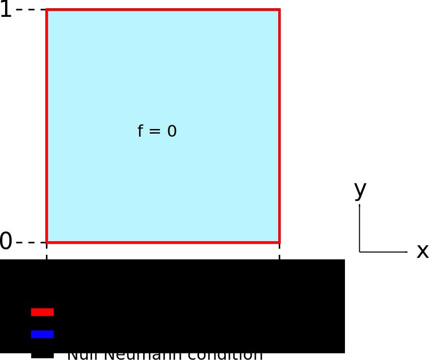
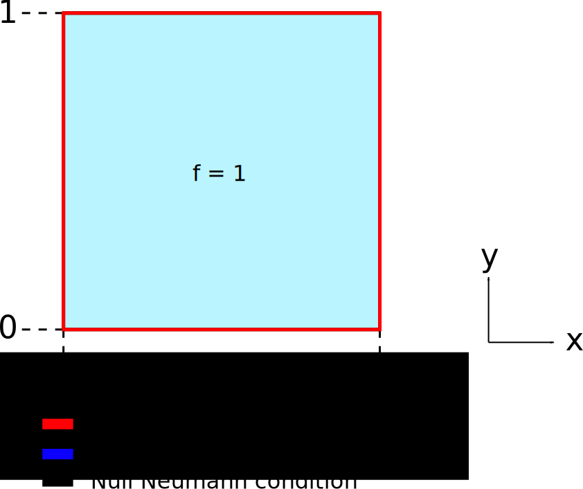
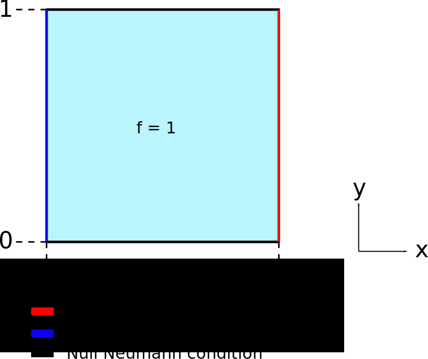
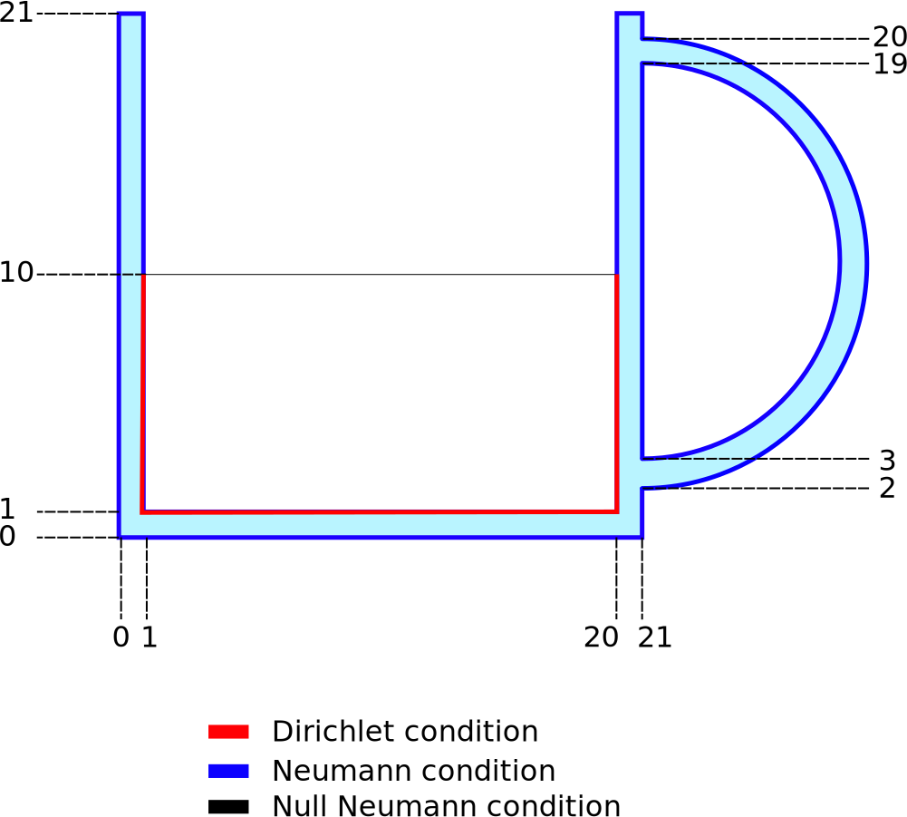
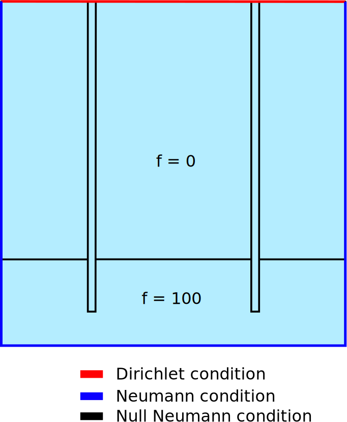

# Simulations proposées

On propose ici quelques problèmes de Poisson auxquels appliquer notre code aux
éléments finis.

*Rappel: implémentez vos simulations dans le fichier src/simu.h*

## Sur un modèle simple  : le carré unitaire

### Problème de Dirichlet pur

Dans ce probleme, on impose uniquement des conditions de Dirichlet. Ce problème
peut être assimilé à une température variable imposée partout sur les
frontières du modèle.

* Conditions de Dirichlet : partout on impose $u = x + y$
* Conditions de Neumann : inexistantes
* Terme source : inexistant
* Coefficient de diffusion : constant ( $k = 1$ )

### Problème de Dirichlet avec terme source

Dans ce probleme, on injecte un terme source constant et on impose une
condition de Dirichlet nulle sur tous les bords.

* Conditions de Dirichlet : partout on impose $u = 0$
* Conditions de Neumann : inexistantes
* Terme source : constant ( $f = 1$ )
* Coefficient de diffusion : constant ( $k = 1$ )

Il sera intéressant d'observer l'évolution de notre solution numérique avec la
résolution du maillage.

### Problème du sinus bump

Ce cas est similaire au problème précédent. Seul le terme source change ; il
est  ici égal à un produit de sinus. Ce problème est très souvent utilisé car
il admet une solution analytique à laquelle comparée notre solution numérique :
$u(x,y) = sin(\pi x)sin(\pi y)$.

* Conditions de Dirichlet : partout on impose $u = 0$
* Conditions de Neumann : inexistantes
* Terme source : $f = 2\pi^2 sin(\pi x) sin(\pi y)$
* Coefficient de diffusion : constant ( $k = 1$ )

On pourra calculer l'erreur commise et observer son évolution avec la
résolution du maillage.

### Problème de Neumann

Dans ce problème, on impose un flux de chaleur entrant sur la frontière 
gauche du modèle, une température nulle sur la frontière droite, et on interdit
les flux de chaleur sur les frontières hautes et basses avec une condition de
Neumann nulle.

* Conditions de Dirichlet : $u = 0$ sur la frontière droite 
* Conditions de Neumann : $h = sin(\pi y)$ sur la frontière gauche, et
nulle sur les frontières haute et basse
* Terme source : $f = 1$
* Coefficient de diffusion : $k = 1$

## Sur des géométries plus complexes

### Diffusion de la chaleur dans un mug

On s'intéresse maintenant à un mug qui contient une certaine quantité d'eau
bouillante.

* Conditions de Dirichlet : constantes sur la porcelaine en contact avec l'eau
bouillante ( $u = 100$ )
* Conditions de Neumann : léger flux de chaleur sortant sur les autres
frontières ( $h = -0.1$ )
* Terme source : inexistant
* Coefficient de diffusion : constant ( $k = 1$ )

### Problème de Géothermie

On définit ici un problème avec deux couches géologiques, la couche profonde
produisant de la chaleur et la couche superficielle ayant un fort potentiel
isolant (i.e. un coefficient de diffusion très faible). 

